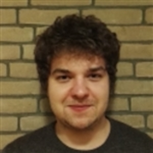
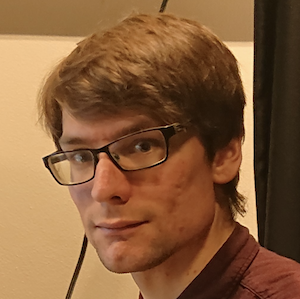
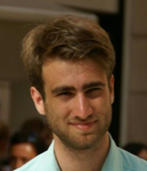
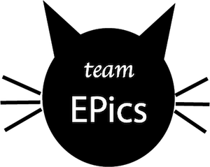

### PhD-students

  **Bohdan Yeroshenko**

  **Zhu Zhang**

### Student members
  **Peter Speets**

  **Kevin Namink**

  **Wouter Wassing**

  **Stijn Helsloot**

### PI
  **Sanli Faez**
[bio](./pages/sanli_bio.md)

### Former members

* **Allard Veenstra** bachelor student
* **Dr. Aquiles Carattino** post-doc, (next move: spin-off company Utopics) [homepage](https://www.aquicarattino.com/)
* **Qianjing Tang** master student, (next move: PhD candidate at Faculty of Geosciences)
* **Lorenzo Sierra Perez** bachelor student, (next move: Master student at Utrecht University)
* **Milo Collaris** bachelor student, (next move: Master student at Utrecht University)
* **Dr. Siddhart Ghosh**, Postdoc (next move: postdoc at the [Single Molecule group](http://www.single-molecule.nl) in Leiden, next: Cambridge University)
* **Zeyu Kuang**, visiting bachelor student, (next move: graduate student at Yale University)
* **Tom Niessen**, bachelor student, (next move: Master student at Utrecht University)
* **Suzan Marsman** bachelor student, (next move: Master student at Utrecht University)
* **Kevin Namink**, bachelor student, (next move: Master student at Utrecht University)