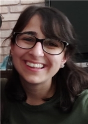
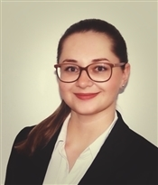

### Postdoctoral researcher

**Itır Bakış Doğru**

### PhD-students

**Anna Peters**

**Zhu Zhang**

**Bohdan Yeroshenko**

### Student members
+ **Stijn Helsloot**
+ **William Hayes**
+ **Ingmar Bruggemann**
+ **Hayley Deckers**

### PI

**Sanli Faez**
[bio](./pages/sanli_bio.md)

### Former team-members

* **Thijs Karman** bachelor student (next move: Data Specialist at Pension Funds PGB)
* **Kevin Namink** Bachelor and Master projects (next move: Software developer at Scientific Volume Imaging)
* **Elise Alkemade** bachelor student (next move: master student, Philosophy of Science, Utrecht)
* **Janice van Dam** bachelor student (next move: master student at TU Delft)
* **Peter Speets** Master student (next move: PhD project at TU Delft)
* **Stijn Helsloot** bachelor student (back in nano-EPics for a master thesis)
* **Allard Veenstra** bachelor student (next move: master student at TU Eindhoven)
* **Dr. Aquiles Carattino** post-doc, (next move: spin-off company Utopics) [homepage](https://www.aquicarattino.com/)
* **Qianjing Tang** master student, (next move: PhD candidate at Faculty of Geosciences)
* **Lorenzo Sierra Perez** bachelor student, (next move: Master student at Utrecht University)
* **Milo Collaris** bachelor student, (next move: Master student at Utrecht University)
* **Dr. Siddhart Ghosh**, Postdoc (next move: postdoc at the [Single Molecule group](http://www.single-molecule.nl) in Leiden, next: Cambridge University)
* **Zeyu Kuang**, visiting bachelor student, (next move: graduate student at Yale University)
* **Tom Niessen**, bachelor student, (next move: Master student at Utrecht University)
* **Suzan Marsman** bachelor student, (next move: Master student at Utrecht University)
