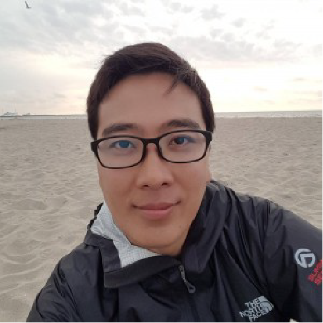
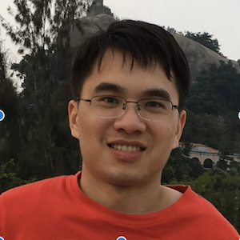
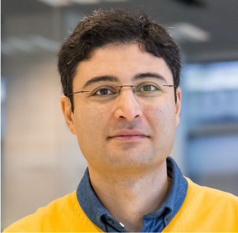

### Postdocs

**Dr. Aquiles Carattino** [bio](./pages/aquiles_bio.md), [homepage]()

### PhD-students

Dashdeleg Baasanjav

Bohdan Yeroshenko

Zhu Zhang

### Student members

Peter Speets

Allard Veenstra

### PI

**Sanli Faez** [bio](./pages/sanli_bio.md)

### Former members
* **Lorenzo Sierra Perez** bachelor student, (next move: Master student at Utrecht University)
* **Milo Collaris** bachelor student, (next move: Master student at Utrecht University)
* **Dr. Siddhart Ghosh**, Postdoc (next move: postdoc at the [Single Molecule group](http://www.single-molecule.nl) in Leiden)
* **Zeyu Kuang**, visiting bachelor student, (next move: graduate student at Yale University)
* **Tom Niessen**, bachelor student, (next move: Master student at Utrecht University)
* **Suzan Marsman** bachelor student, (next move: Master student at Utrecht University)
* **Kevin Namink**, bachelor student, (next move: Master student at Utrecht University)